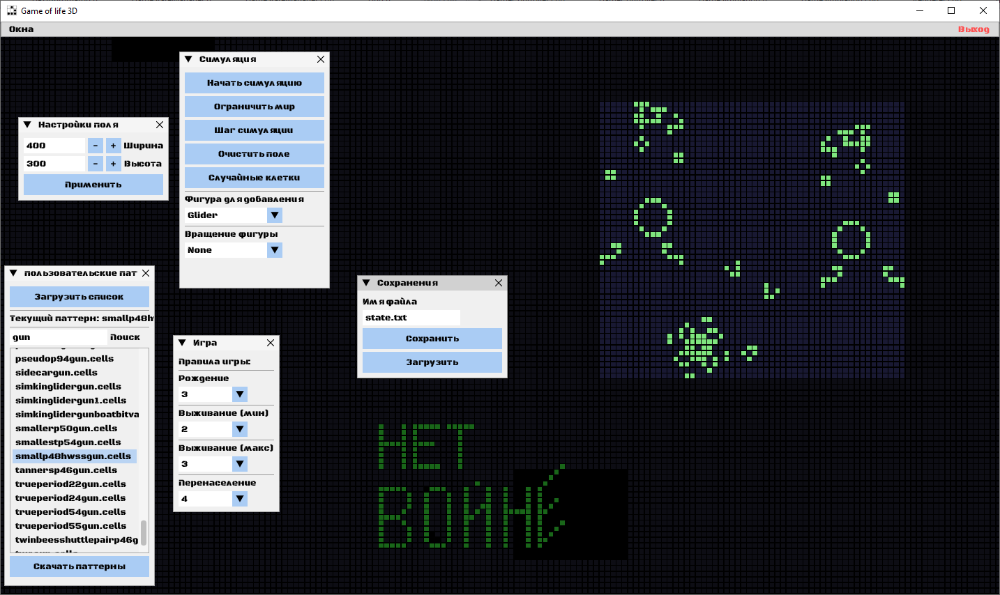

# Game of Life 3D




## Обзор

**Game of Life 3D** - это визуализация классической игры "Жизнь" Конвея в 3D с использованием OpenGL. Проект позволяет пользователям исследовать динамику клеточных автоматов в интерактивной среде, где вы можете вращать, перемещать камеру и взаимодействовать с клетками.

Данный проект расширяет классический клеточный автомат "Жизнь" в 3D. Клетки существуют на сетке, где их жизнь или смерть в каждом поколении зависит от количества соседних клеток.

### Скачать

Чтобы скачать последнюю версию программы, нажмите на следующую ссылку:

[Скачать последний релиз](https://github.com/AsuRaHan/GameOfLife3D/releases/latest)

**Проект включает в себя**:

- **3D Визуализация**: Отображение сетки и клеток в трёхмерном пространстве.
- **Взаимодействие с пользователем**: Управление симуляцией, движение камеры и изменение состояния клеток.
- **Рендеринг OpenGL**: Использование современных методов OpenGL для достижения высокой производительности.
- **Интерфейс пользователя ImGui**: Библиотека позволяет легко настраивать и изменять интерфейсы.
- **Управление Паттернами**: Добавлена возможность загрузки и размещения паттернов из файлов .cells через класс PatternManager, что упрощает добавление новых фигур в игру.

**Правила игры следующие**:

- **Начальное состояние**: Игра начинается с начальной конфигурации клеток, где некоторые клетки живы, а другие мертвы.
- **Соседство**: Каждая клетка имеет восемь соседей (клетки, которые находятся непосредственно рядом, включая диагональные).
- **Правила обновления**: На каждом шаге (или поколении) состояние каждой клетки обновляется в соответствии с следующими правилами:
- **Смерть от одиночества**: Живая клетка умирает, если у нее меньше двух живых соседей.
- **Смерть от перенаселенности**: Живая клетка умирает, если у нее больше трех живых соседей.
- **Выживание**: Живая клетка остается живой, если у нее два или три живых соседа.
- **Рождение**: Мертвая клетка становится живой, если у нее ровно три живых соседа.
- **Поколения**: После применения правил ко всем клеткам, создается новое поколение, и процесс повторяется.

## Основные функции

- **3D визуализация**: Игра отображается в трехмерном пространстве, где клетки представлены на плоскости.
- **Реализация на GPU**: Для ускорения симуляции используется GPU через OpenGL Compute Shaders.
- - **Интерактивное управление**:
  - **Навигация камеры**: Используйте клавиши WSAD для перемещения камеры.
  - **Изменение состояния клеток**: Левая кнопка мыши позволяет переключать состояние клеток (живые/мертвые).
- **Цветная клеточная сетка**: Клетки могут иметь разные цвета в зависимости от их состояния и типа.
- **Управление симуляцией**:
  - **Запуск/остановка**: Пробел для управления симуляцией.
  - **Пошаговое выполнение**: Стрелки вправо для перехода к следующему поколению.
- **Рандомизация сетки**: Клавиша 'R' для случайного заполнения поля.
- **Управление правилами**: Реализована возможность динамически менять правила игры:
  - **Рождение**: Количество живых соседей, необходимое для рождения новой клетки.
  - **Выживание**: Минимальное и максимальное количество живых соседей, при котором клетка выживает.
  - **Перенаселение**: Количество живых соседей, при котором клетка умирает от перенаселения.
- **Интерфейс пользователя**: Используется ImGui для создания пользовательского интерфейса:
  - Управление симуляцией (старт, стоп, следующий шаг).
  - Выбор и размещение паттернов (Glider, Blinker и т.д.).
  - Настройка правил игры через комбобоксы.
- **Сетка и визуализация**: 
  - Возможность переключаться между отображением и скрытием сетки.
  - Поддержка тороидального мира или ограниченного поля.
- **Сохранение и загрузка**: Механизмы для сохранения и загрузки состояния игры.
- **Камера**: Реализована навигация по 3D пространству с возможностью перемещения камеры.

## Управление

- **Пробел**: Запуск/остановка симуляции.
- **ENTER**: Шаг вперёд.
- **Колесико мыши**: Масштабирование (зум). Чтобы увеличить скорость масштабирования, удерживайте левый Control (Ctrl).
- **Правый клик и перетаскивание**: Перемещение камеры.
- **WSADQE**: Перемещение камеры вперед, назад, влево, вправо, вверх, вниз.
- **T**: Сброс камеры, чтобы весь игровой мир был виден.
- **R**: Случайное заполнение поля.
- **C**: Очистка поля, убить все клетки.
- **I**: Заполнить поле случайным числом фигур.
- **G**: Спрятать или показать сетку.
- **U**: Спрятать или показать пользовательский интерфейс GUI.
- **Y**: Сменить тип мира (сетка с ограниченными краями или с тороидальными краями).
- **ЛКМ**: Изменение состояния клетки под курсором.
- **ЛКМ + SHIFT и перетаскивание**: Выделить поле, после чего клавишами **INSERT** вставить в выделеное место живые клетки, на **DELETE** удалить живые клетки, **ESCAPE** снять выделение.
- **СКМ (клик колесиком мыши)**: Добавить фигуру из предустановленных петтернов(шаблонов) или из выбранных файлов.
- **Клавиши от 1 до 6**: Выбор различных предустановленных паттернов для размещения на поле:
  - **1**: Глайдер
  - **2**: Мигалка (Blinker)
  - **3**: Живок (Toad)
  - **4**: Баржа (Beacon)
  - **5**: Маятник (Pentadecathlon)
  - **6**: Ружьё Госпера (Gosper Glider Gun)

## Установка

Для настройки и запуска проекта:

1. **Необходимые условия**:
   - Операционная система Windows
   - Visual Studio с инструментами для разработки на C++
   - Библиотеки и заголовочные файлы OpenGL

2. **Установка**:

```bash
git clone --recursive https://github.com/AsuRaHan/GameOfLife3D.git
cd GameOfLife3D
git submodule update --init --recursive
```

3. **Обновление репозитория и подмодулей:**
	- Перейдите в вашу директорию проекта

```bash
git pull origin main
git submodule update --recursive --remote
```

4. **Сборка**:
	- Откройте проект в Visual Studio 2022 или выше.
	- Настройте для разработки на Windows с поддержкой OpenGL.
	- Соберите решение.

5. **Сборка через гитхаб**
	- Внесите изменение в проект, подготовте релиз.
	- Сделайте `git tag`.
```bash
git tag -a v1.0.0 -m "Версия 1.0.0"
git push origin v1.0.0
```

6. **Запуск**:
   - Запустите собранное приложение.
   - Так же можно передать параметры в комендной строке что бы указать размер игрового поля *-gridWidth 200* *-gridHeight 150* по умолчанию 300x400. так же можно запустить в полноэкранном режиме передав параметр *-fullscreen* установить разрешение полноэкранного режима *-screenResolution 800x600* `life.exe -gridWidth 200 -gridHeight 150 -screenResolution 800x600 -fullscreen` смотрите пример в [run_life.bat](run_life.bat)
	
## Возможности

- **Управление симуляцией**:
  - Запуск/Остановка симуляции
  - Пошаговое продвижение по поколениям

- **Управление камерой в 3D**:
  - Панорамирование, масштабирование

- **Управление сеткой**:
  - Инициализация сетки случайными клетками
  - Изменение состояния отдельных клеток мышкой

## Используемые технологии

- **C++** для основной логики и механики игры
- **OpenGL** для визуализации
- **Windows API** для управления окнами и обработки событий
- **ImGuiI** для пользовательского интерфейса

## Структура проекта

- **./game**: Основная логика игры:
  - `Grid.h`, `Grid.cpp` - Управление сеткой
  - `GameSimulation.h`, `GameSimulation.cpp` - Правила и логика игры (Кандидат на удаление)
  - `GameController.h`, `GameController.cpp` - Управление состоянием игры
  - `GPUAutomaton.h`, `GPUAutomaton.cpp` - Клеточный автомат, использующий для расчёта GPU
  - `GameStateManager.h`, `GameStateManager.cpp` - Управление загрузкой и сохранением мира
  - `PatternManager.h`, `PatternManager.cpp` - Управление загрузкой готовых паттернов

- **./rendering**: Код, связанный с рендерингом:
  - `Camera.h`, `Camera.cpp` - Камера для 3D вида.
  - `CameraController.h`, `CameraController.cpp` - Управление камерой.
  - `Renderer.h`, `Renderer.cpp` - Логика рендеринга в OpenGL.
  - `UIRenderer.h`, `UIRenderer.cpp` - Отрисовка и работа с GUI окна и меню.
  - `SelectionRenderer.h`, `SelectionRenderer.cpp` - Отрисовка линий выделения поля мышкой.
  - `CellInstance.h` - Структура для хранения инстанса дивых и мертвых клеток для оптимальной отрисовки в OpenGL.
  - `IRendererProvider.h` - Проводник обеспечивающий обмен данными между разными классами. Это простой интерфейс, паттерн провайдер.

- **./mathematics**: Математические утилиты:
  - `Matrix4x4.h`, `Matrix4x4.cpp` - Операции с матрицами (на данный момент не используется)
  - `Vector3d.h`, `Vector3d.cpp` - Операции с векторами

- **./windowing**: Управление окнами и вводом:
  - `MainWindow.h`, `MainWindow.cpp` - Создание окна и базовая обработка событий
  - `WindowController.h`, `WindowController.cpp` - Обработка событий клавиатуры и мыши
  - `GridPicker.h`, `GridPicker.cpp` - Обработка кликов по сетке (игровому полю)

- **./system**: Настройка системы, OpenGL и пользовательского ввода:
  - `OpenGLInitializer.h`, `OpenGLInitializer.cpp` - Инициализация контекста OpenGL
  - `GLFunctions.h`, `GLFunctions.cpp` - Загрузка функций OpenGL (урезанный GLAD)
  - `ShaderManager.h`, `ShaderManager.cpp` - Создание компиляция проверка шейдеров (GLSL) OpenGL
  - `SettingsManager.h`, `SettingsManager.cpp` - Сохранение и загрузка пользовательских настроек.
  - `InputHandler.h`, `InputHandler.cpp` - Обработчик пользовательского ввода (клавиатура мыш).
  - `InputEvent.h` - Сама структура пользовательского ввода.

- **main.cpp**: Точка входа приложения

## Известные проблемы

- Производительность может ухудшаться на очень больших сетках из-за сложности 3D визуализации и вычисления живых и неживых клеток.
- Если устанавливать очень большой мир то требуется довольно продолжительное время для перестроки сетки из за этого игра может зависнуть на некоторое время(зависит от размеров мира)
- Слишком большие миры могут долга загружатся или сохранятся

### Будущие улучшения

- [x] Реализация различных наборов правил для "Жизни".
- [x] Управления изменения размера сетки.
- [x] Оптимизация рендеринга для лучшей производительности на больших сетках или более сложных узорах.
- [x] Реализована загрузка паттернов (сложных узорах) из файлов в дириктории `patterns` в формате *.cells* 
- [ ] Оптимизиция закгрузки и сохранения мира.
- [ ] Оптимизация динамической смены размеров мира

## Изменения и оптимизации

- **Оптимизация производительности**:
  На данный момент внесены следующие улучшения:

- **Уменьшение количества итераций**: 
  Ранее в рамках основного цикла игры существовало три вложенных цикла. Теперь операции сведены к двум основным циклам:
  - Загрузка данных на GPU и вычисление следующего поколения
  - Непосредственное обновление цветов клеток после вычисления на GPU
  - Теперь и раскраска клеток идет через GPU

- **Это изменение обеспечивает, что**:
	- Цвет клетки обновляется сразу после изменения её состояния, что делает процесс более интуитивно понятным и предотвращает дублирование данных.
	- Улучшается синхронизация между логикой игры и её визуализацией.


## От автора

Не стесняйтесь сообщать о любых проблемах или предлагать улучшения!
- Если вы хотите внести свой вклад:
  - Создайте форк репозитория
  - Сделайте изменения в своей копии
  - Отправьте pull request с описанием изменений
- Связаться со мной вы можете в [телеграмм](https://t.me/AsuRaHan)
- Собираю донаты [тут](https://boosty.to/asurahan/single-payment/donation/677381/target?share=target_link)

## Что читал, кем вдохновлялся и где черпал информацию

Это мой первый проект на WinAPI и OpenGL.
- Как работать с OpenGL подглядел [тут](https://github.com/msqrt)
- Что такое игра "Жизнь" и про сам клеточный автомат читал [тут](https://conwaylife.com/)
- Особая благодарность [IT-сообществу моего города](https://t.me/dc78422)

## Лицензия

Этот проект находится под [лицензией MIT](LICENSE).
