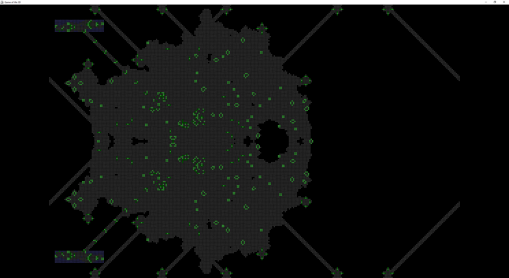

# Game of Life 3D




## Обзор

**Game of Life 3D** - это визуализация классической игры "Жизнь" Конвея в 3D с использованием OpenGL. Проект позволяет пользователям исследовать динамику клеточных автоматов в интерактивной среде, где вы можете вращать, перемещать камеру и взаимодействовать с клетками.

Данный проект расширяет классический клеточный автомат "Жизнь" в 3D. Клетки существуют на сетке, где их жизнь или смерть в каждом поколении зависит от количества соседних клеток.

**Проект включает в себя**:

- **3D Визуализация**: Отображение сетки и клеток в трёхмерном пространстве.
- **Взаимодействие с пользователем**: Управление симуляцией, движение камеры и изменение состояния клеток.
- **Рендеринг OpenGL**: Использование современных методов OpenGL для достижения высокой производительности.
- **Интерфейс пользователя ImGui**: Библиотека позволяет легко настраивать и изменять интерфейсы.

**Правила игры следующие**:

- **Начальное состояние**: Игра начинается с начальной конфигурации клеток, где некоторые клетки живы, а другие мертвы.
- **Соседство**: Каждая клетка имеет восемь соседей (клетки, которые находятся непосредственно рядом, включая диагональные).
- **Правила обновления**: На каждом шаге (или поколении) состояние каждой клетки обновляется в соответствии с следующими правилами:
- **Смерть от одиночества**: Живая клетка умирает, если у нее меньше двух живых соседей.
- **Смерть от перенаселенности**: Живая клетка умирает, если у нее больше трех живых соседей.
- **Выживание**: Живая клетка остается живой, если у нее два или три живых соседа.
- **Рождение**: Мертвая клетка становится живой, если у нее ровно три живых соседа.
- **Поколения**: После применения правил ко всем клеткам, создается новое поколение, и процесс повторяется.

## Основные функции

- **3D визуализация**: Игра отображается в трехмерном пространстве, где клетки представлены на плоскости.
- **Интерактивное управление**:
  - **Навигация камеры**: Используйте клавиши WSAD для перемещения камеры, мышь для вращения (средняя кнопка мыши).
  - **Изменение состояния клеток**: Левая кнопка мыши позволяет переключать состояние клеток (живые/мертвые).
- **Цветная клеточная сетка**: Клетки могут иметь разные цвета в зависимости от их состояния и типа.
- **Управление симуляцией**:
  - **Запуск/остановка**: Пробел для управления симуляцией.
  - **Пошаговое выполнение**: Стрелки вправо для перехода к следующему поколению.
- **Рандомизация сетки**: Клавиша 'R' для случайного заполнения поля.


## Установка

Для настройки и запуска проекта:

1. **Необходимые условия**:
   - Операционная система Windows
   - Visual Studio с инструментами для разработки на C++
   - Библиотеки и заголовочные файлы OpenGL

2. **Установка**:

```bash
git clone --recursive https://github.com/AsuRaHan/GameOfLife3D.git
cd GameOfLife3D
git submodule update --init --recursive
```

3. **Обновление репозитория и подмодулей:**
	- Перейдите в вашу директорию проекта

```bash
git pull origin main
git submodule update --recursive --remote
```

4. **Сборка**:
	- Откройте проект в Visual Studio.
	- Настройте для разработки на Windows с поддержкой OpenGL.
	- Соберите решение.

5. **Запуск**:
   - Запустите собранное приложение.
   - Так же можно передать параметры в комендной строке что бы указать размер игрового поля, по умолчанию 300x400. так же можно запустить в полноэкранном режиме передав параметр -fullscreen `life.exe -gridWidth 200 -gridHeight 150 -fullscreen` смотрите пример в [run_life.bat](run_life.bat)
	
## Возможности

- **Управление симуляцией**:
  - Запуск/Остановка симуляции
  - Пошаговое продвижение по поколениям

- **Управление камерой в 3D**:
  - Панорамирование, масштабирование

- **Управление сеткой**:
  - Инициализация сетки случайными клетками
  - Изменение состояния отдельных клеток мышкой

## Используемые технологии

- **C++** для основной логики и механики игры
- **OpenGL** для визуализации
- **Windows API** для управления окнами и обработки событий
- **ImGuiI** для пользовательского интерфейса

## Структура проекта

- **./game**: Основная логика игры
  - `Cell.h`, `Cell.cpp` - Реализация класса клетки
  - `Grid.h`, `Grid.cpp` - Управление сеткой
  - `GameOfLife.h`, `GameOfLife.cpp` - Правила и логика игры
  - `GameController.h`, `GameController.cpp` - Управление состоянием игры
  - `GPUAutomaton.h`, `GPUAutomaton.cpp` - Клеточный автомат использующий для ресчета GPU
  - `GameStateManager.h`, `GameStateManager.cpp` - Управление загрузкой и сохранением мира

- **./rendering**: Код, связанный с рендерингом
  - `Camera.h`, `Camera.cpp` - Управление камерой для 3D вида
  - `Renderer.h`, `Renderer.cpp` - Логика рендеринга в OpenGL

- **./mathematics**: Математические утилиты
  - `Matrix4x4.h`, `Matrix4x4.cpp` - Операции с матрицами (на данный момент не используется)
  - `Vector3d.h`, `Vector3d.cpp` - Операции с векторами

- **./windowing**: Управление окнами и вводом
  - `MainWindow.h`, `MainWindow.cpp` - Создание окна и базовая обработка событий
  - `WindowController.h`, `WindowController.cpp` - Обработка событий
  - `GridPicker.h`, `GridPicker.cpp` - Обработка кликов по сетке (игровому полю)

- **./system**: Настройка системы и OpenGL
  - `OpenGLInitializer.h`, `OpenGLInitializer.cpp` - Инициализация контекста OpenGL
  - `GLFunctions.h`, `GLFunctions.cpp` - Загрузка функций OpenGL
  - `ShaderManager.h`, `ShaderManager.cpp` - Создание компиляция проверка шейдеров (GLSL) OpenGL

- **main.cpp**: Точка входа приложения

## Управление

- **Esc**: Выход из игры. закрытие приложения.
- **Пробел**: Запуск/остановка симуляции.
- **Клавиша '+' на нумпаде**: Уведичить скорость симуляции.
- **Клавиша '-' на нумпаде**: Уменьшить скорость симуляции.
- **Правая стрелка**: Шаг вперёд, **Левая стрелка**: Шаг назад. *Колличесто шагов назад ограничено в 100 шагов.*
- **Колесико мыши**: Масштабирование (зум) что бы увеличить скорость маштабирования удерживайте левый контрол (ctrl).
- **Правый клик и перетаскивание**: Перемещение камеры.
- **WSAD**: Перемещение камеры вперед, назад, влево, вправо.
- **T**: Сброс камеры, чтобы весь игровой мир был виден.
- **R**: Случайное заполнение поля.
- **C**: Очистка поля, убить всех.
- **I**: Заполнить поле случайным числом глайдеров.
- **G**: Спрятать или показать сетку.
- **Y**: Сменить тип мира `сетка с ограниченными краями или с тороидальными краями`.
- **ЛКМ**: Изменение состояния клетки под курсором.
- **СКМ (клик колесиком мышы)**: Добавить фигуру из предустановленных петтернов(шаблонов).
- **Клавиши от 1 до 6**: Выбор различных предустановленных паттернов для размещения на поле:
  - **1**: Глайдер
  - **2**: Мигалка (Blinker)
  - **3**: Живок (Toad)
  - **4**: Баржа (Beacon)
  - **5**: Маятник (Pentadecathlon)
  - **6**: Ружьё Госпера (Gosper Glider Gun)

## Известные проблемы

- Производительность может ухудшаться на очень больших сетках из-за сложности 3D визуализации и вычисления живых и неживых клеток.

### Будущие улучшения

- [ ] Реализация различных наборов правил для "Жизни".
- [ ] Управления изменения размера сетки.
- [x] Оптимизация рендеринга для лучшей производительности на больших сетках или более сложных узорах.

## От автор

Не стесняйтесь сообщать о любых проблемах или предлагать улучшения!
- Если вы хотите внести свой вклад, пожалуйста:
- Создайте форк репозитория.
- Сделайте изменения в своей копии.
- Отправьте pull request с описанием изменений.
- Связатся со мной вы можете в [телеграмм](https://t.me/AsuRaHan)
- Собираю донаты [тут](https://boosty.to/asurahan/single-payment/donation/677381/target?share=target_link)

## Что читал кем вдохновлялся и где черпал информацию

Этой мой первый проект на WinApi и OpenGL.
- Как работать с OpenGL подглядел [тут](https://github.com/msqrt)
- Что такое игра жизнь и про сам клеточный автомат читал [тут](https://conwaylife.com/)
- Ну и особая благодарность [IT сообществу моего города](https://t.me/dc78422)

## Лицензия

Этот проект находится под [лицензией MIT](LICENSE).
